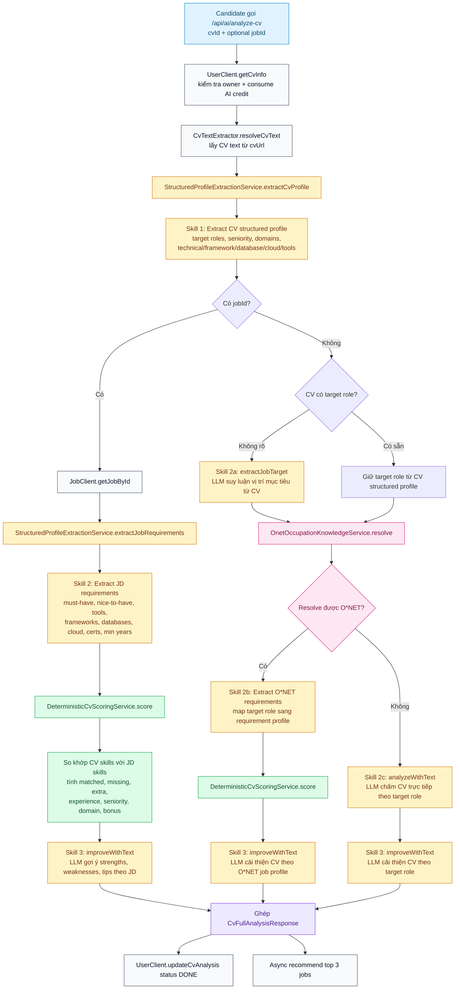
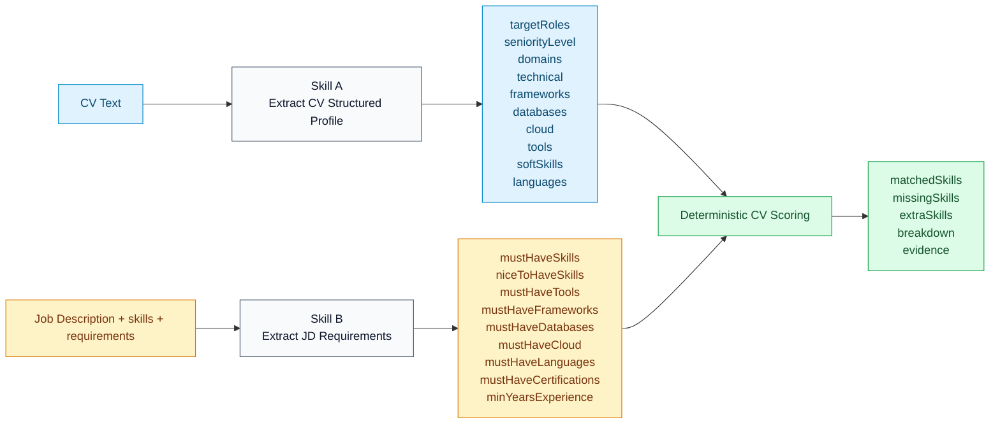
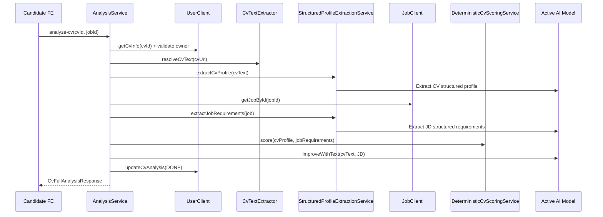
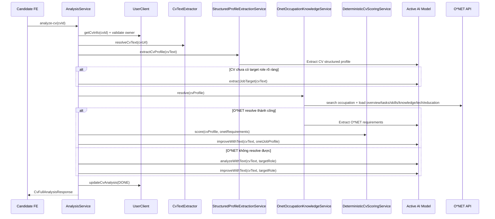

# CV Analysis Flow

Sơ đồ này mô tả luồng chức năng `POST /api/ai/analyze-cv` trong `ai_engine_service`, tách rõ 2 trường hợp:
- Có `jobId`: so CV với JD cụ thể
- Không có `jobId`: suy luận nghề mục tiêu từ CV, sau đó đối chiếu với O*NET hoặc fallback LLM

Các khối "skill" bên dưới bám theo code hiện tại trong:
- `AnalysisService`
- `StructuredProfileExtractionService`
- `DeterministicCvScoringService`
- `OnetOccupationKnowledgeService`

## 1. Luồng tổng quát

## 2. CV và JD đi qua những "skill" nào

## 3. Trường hợp có JD

## 4. Trường hợp không có JD

## 5. Tóm tắt theo nhánh

- Có JD:
  CV đi qua `extractCvProfile`, JD đi qua `extractJobRequirements`, sau đó vào `DeterministicCvScoringService.score`, cuối cùng gọi `improveWithText`.
- Không có JD nhưng resolve được O*NET:
  CV đi qua `extractCvProfile`, có thể thêm `extractJobTarget`, rồi qua `OnetOccupationKnowledgeService.resolve`, tiếp tục `score`, cuối cùng `improveWithText`.
- Không có JD và không resolve được O*NET:
  CV đi qua `extractCvProfile`, có thể thêm `extractJobTarget`, sau đó LLM chấm trực tiếp bằng `analyzeWithText`, rồi `improveWithText`.
