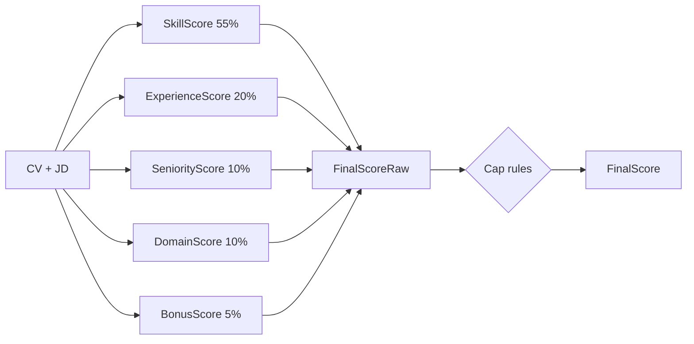

# CV Scoring Formula

Tài liệu này trình bày công thức tính điểm CV trong `ai_engine_service` theo dạng phù hợp để đưa vào báo cáo.

Nguồn triển khai: [`DeterministicCvScoringService.java`](/home/chuongpl/projects/smartCv/backend/ai_engine_service/src/main/java/vn/chuongpl/ai_engine_service/features/analysis/DeterministicCvScoringService.java)

## 1. Công thức điểm tổng

```text
FinalScoreRaw
= 0.55 * SkillScore
+ 0.20 * ExperienceScore
+ 0.10 * SeniorityScore
+ 0.10 * DomainScore
+ 0.05 * BonusScore
```

Trong đó:

```text
FinalScore = clamp(FinalScoreRaw, 0, 100)
```

## 2. Công thức từng thành phần

### 2.1. Skill Score

```text
MustCoverage = MatchedMustHave / TotalMustHave
NiceCoverage = MatchedNiceToHave / TotalNiceToHave

SkillScore = ((0.82 * MustCoverage) + (0.18 * NiceCoverage)) * 100
```

Ý nghĩa:
- Ưu tiên kỹ năng bắt buộc (`must-have`) với trọng số 82%
- Kỹ năng cộng điểm (`nice-to-have`) chiếm 18%

### 2.2. Experience Score

```text
YearsRatio = CandidateYears / MinYearsRequired
RelevanceRatio = RelevantExperienceSignals / RequiredSkillSignals

ExperienceScore = (0.70 * YearsRatio + 0.30 * RelevanceRatio) * 100
```

Ghi chú:
- Nếu JD không có `MinYearsRequired`, hệ thống dùng giá trị mặc định mềm
- `RelevantExperienceSignals` được lấy từ experience items trong CV có liên hệ với kỹ năng yêu cầu

### 2.3. Seniority Score

```text
Distance = |SeniorityRank(CV) - SeniorityRank(JD)|
```

```text
Distance = 0  => SeniorityScore = 100
Distance = 1  => SeniorityScore = 80
Distance = 2  => SeniorityScore = 55
Distance > 2  => SeniorityScore = 30
```

### 2.4. Domain Score

```text
CV domain khớp JD domain      => DomainScore = 100
CV không có domain rõ ràng    => DomainScore = 60
CV domain không khớp JD       => DomainScore = 35
```

### 2.5. Bonus Score

```text
BonusScore
= 0.40 * CertificationMatchScore
+ 0.40 * NiceToHaveCoverageScore
+ 0.20 * ProjectEvidenceScore
```

Trong đó:
- `CertificationMatchScore`: mức độ đáp ứng chứng chỉ yêu cầu
- `NiceToHaveCoverageScore`: tỷ lệ đáp ứng kỹ năng cộng điểm
- `ProjectEvidenceScore`: mức độ có bằng chứng kỹ năng trong project

## 3. Công thức đầy đủ cho báo cáo

```text
FinalScoreRaw
= 0.55 * [((0.82 * MustCoverage) + (0.18 * NiceCoverage)) * 100]
+ 0.20 * ExperienceScore
+ 0.10 * SeniorityScore
+ 0.10 * DomainScore
+ 0.05 * [(0.40 * CertificationMatchScore)
        + (0.40 * NiceToHaveCoverageScore)
        + (0.20 * ProjectEvidenceScore)]
```

## 4. Điều kiện chặn điểm

Sau khi tính `FinalScoreRaw`, hệ thống áp dụng các rule cap:

```text
Nếu không match được bất kỳ must-have nào:
    FinalScore <= 35

Nếu số kỹ năng must-have >= 3 và MustCoverage < 40%:
    FinalScore <= 55

Nếu CandidateYears < 0.5 * MinYearsRequired:
    FinalScore <= 65
```

## 5. Sơ đồ công thức



## 6. Thang nhãn điểm

```text
Score >= 85  => Excellent
Score >= 70  => Good
Score >= 50  => Fair
Score < 50   => Poor
```
